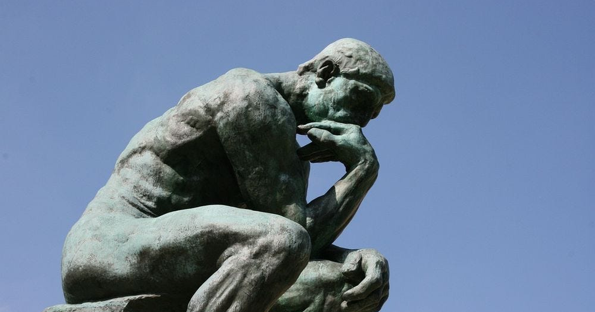

# Secret Systems

A sourced, single-page history of how early religious pluralism in the Roman world was suppressed by imperial law — and how that history sits directly underneath the First Amendment.

Starting from the 1945 discovery of the Nag Hammadi codices, the piece traces a documented chain of events: the Theodosian Code's criminalization of banned texts, the Albigensian Crusade against the Cathars, the trial of Giordano Bruno, and the centuries-long life of the Index Librorum Prohibitorum. It then turns to Jefferson's Virginia Statute for Religious Freedom and Madison's *Memorial and Remonstrance* to show, in the Founders' own words, how directly aware they were of this history when they wrote the religion clauses of the First Amendment.

The piece closes with open questions rather than settled conclusions — about why anti-institutional religious movements keep recurring independently across unconnected times and places, and about what legal protection does and doesn't change about the social cost of heterodox belief.

Every historical claim is drawn from named, citable scholarship — Elaine Pagels, Walter Bauer, Hans Jonas, R.I. Moore, Malcolm Lambert, and primary sources including the Codex Theodosianus and Jefferson's and Madison's own writings. A full bibliography is included on the page.

## Files

- `index.html` — the full article
- `404.html` — custom not-found page
- `sitemap.xml`, `robots.txt`, `.nojekyll` — technical SEO
- `LICENSE` — MIT

## Theme

Stone, marble, and sky — built around a photograph of Rodin's *The Thinker* as the hero and favicon, weathered bronze against a fresco-blue horizon.
